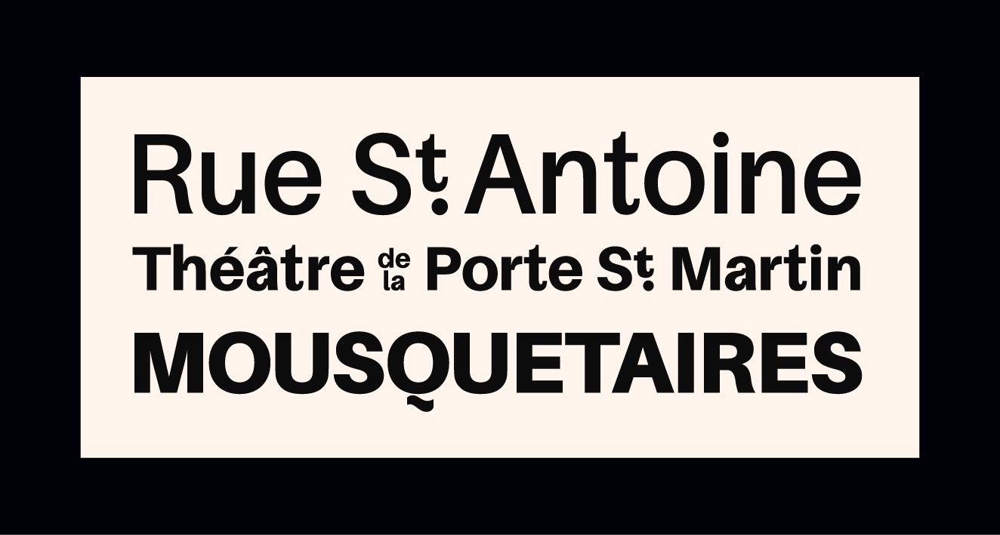

# St. Martin

St. Martin highlights a typographic artifact found in the works of the 19th-century Parisian printer Jean-Alexis Rouchon and applies it to a sans-serif base. In the accompanying essay, [*St. Martin, the Stencil Type that Wasn’t*](https://carljkurtz.de/pages/stmartin/index.html), I speculate on the possible origins of the defining feature of the design.

St. Martin was created in 2024 by Carl J. Kurtz for the class Ghostly Presences at the HAW Hamburg, in which the students examined the works of the 19th-century Parisian printer Jean-Alexis Rouchon.

## License
The St. Martin font software is licensed under the SIL Open Font License, Version 1.1. (See [LICENSE.txt](LICENSE.txt) and visit http://scripts.sil.org/OFL for FAQs and more information.

## Support
St. Martin is entirely free of charge for both commercial and private use. But type doesn't design itself — so please consider sharing this project with a fellow designer, or even support the project by sponsoring it here on GitHub.

## Acknowledgements
This font was designed for the 2024 class Ghostly Presences at the HAW Hamburg under the guidance of Pierre Pané-Farré and Simon Thiefes.

St. Martin is a modification of Mirat-Masson’s 2022 typeface Amiamie, which itself is based on Sora Sagano’s Aileron, designed in 2014 for TipoType. All of these fonts are licensed under the SIL Open Font License, Version 1.1. 